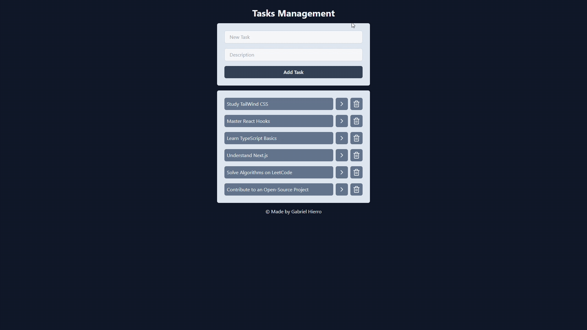

# 📝 React Task Manager
Um gerenciador de tarefas moderno e responsivo construído com as tecnologias mais recentes do ecossistema React. Este projeto foi desenvolvido como parte dos meus estudos em desenvolvimento front-end, focando em componentização, estado e estilização eficiente.

## 💻 Demonstração


## ✨ Funcionalidades
- **Adicionar novas tarefas:** Campo de input intuitivo para adicionar novas tarefas à lista.

- **Marcar como concluída:** Clique em uma tarefa para alternar seu estado entre pendente e concluída.

- **Remover tarefas:** Exclua tarefas que não são mais necessárias.

- **Design Responsivo:** Interface que se adapta perfeitamente a desktops, tablets e smartphones.

- **Estilização com Tailwind CSS:** Componentes estilizados com classes utilitárias para um desenvolvimento rápido e consistente.

## 🚀 Tecnologias Utilizadas
Este projeto foi construído utilizando as seguintes tecnologias:

- [React](https://react.dev): Biblioteca para construir interfaces de usuário.

- [Vite](https://vite.dev): Ferramenta de build extremamente rápida para o desenvolvimento front-end moderno.

- [TailWind CSS](https://tailwindcss.com): Framework de CSS utility-first para estilização.

- [Node.js](https://nodejs.org/pt): Ambiente de execução JavaScript.

## 📦 Como Rodar o Projeto
Siga os passos abaixo para executar o projeto em sua máquina local.
```
# 1. Clone o repositório
git clone https://github.com/gabrielhierro/task-manager-project/.git

# 2. Navegue até o diretório do projeto
cd task-manager-project

# 3. Instale as dependências
npm install

# 4. Inicie o servidor de desenvolvimento
npm run dev
```
Após executar o último comando, o projeto estará disponível em http://localhost:5173 (ou a porta que o Vite indicar no seu terminal).

### 🎓 Agradecimentos e Fonte de Aprendizado
Este projeto foi desenvolvido com base nos conhecimentos adquiridos no [Curso de React para Completos Iniciantes](https://www.youtube.com/watch?v=2RWsLmu8yVc) do canal Felipe Rocha • Full Stack Club no YouTube.

Um agradecimento especial ao Felipe por disponibilizar um conteúdo gratuito e de altíssima qualidade para a comunidade.


### 👨‍💻 Autor
Feito com ❤️ por Gabriel Hierro

### 📄 Licença
Este projeto está sob a licença MIT. Veja o arquivo  para mais detalhes.
